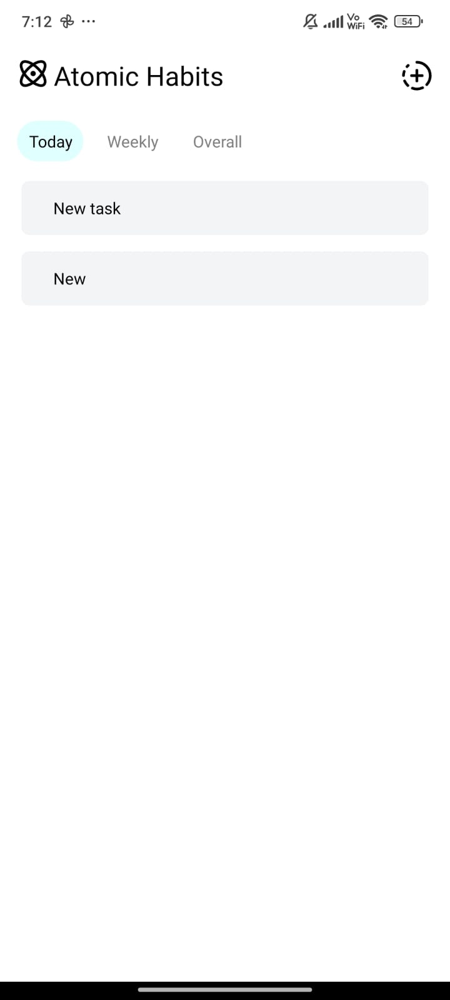
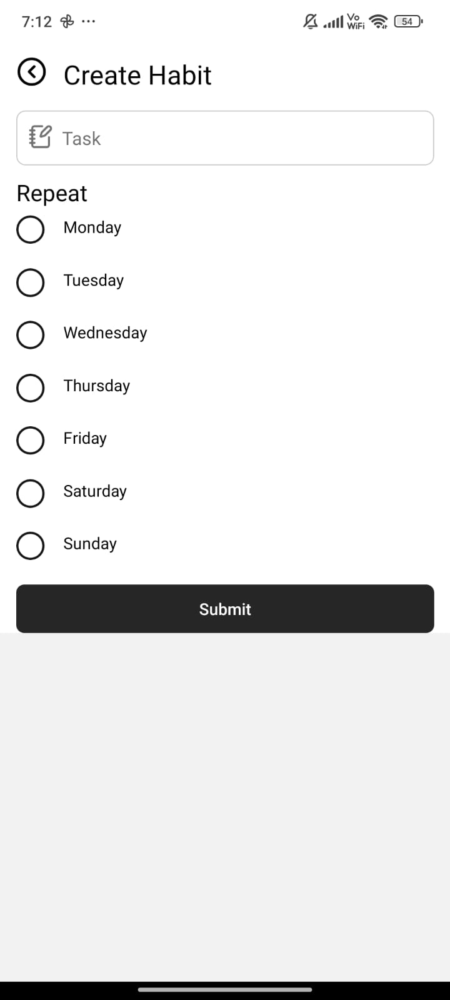
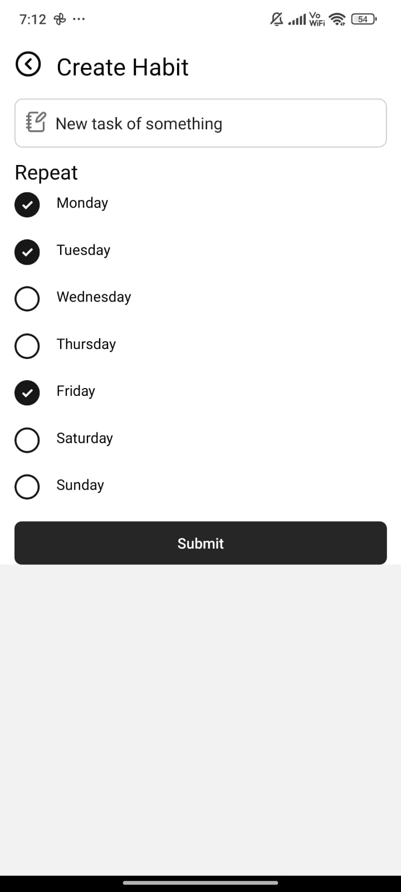
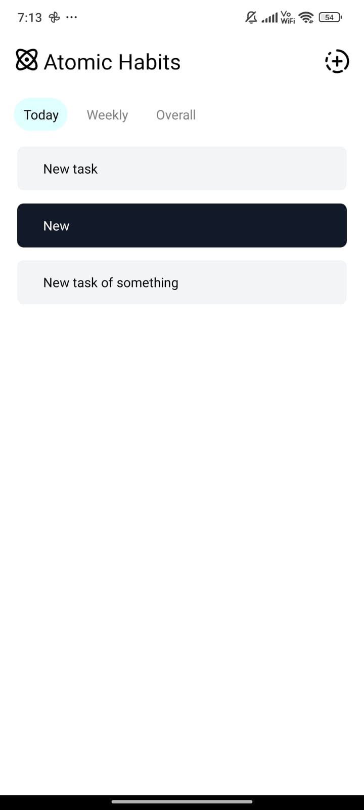
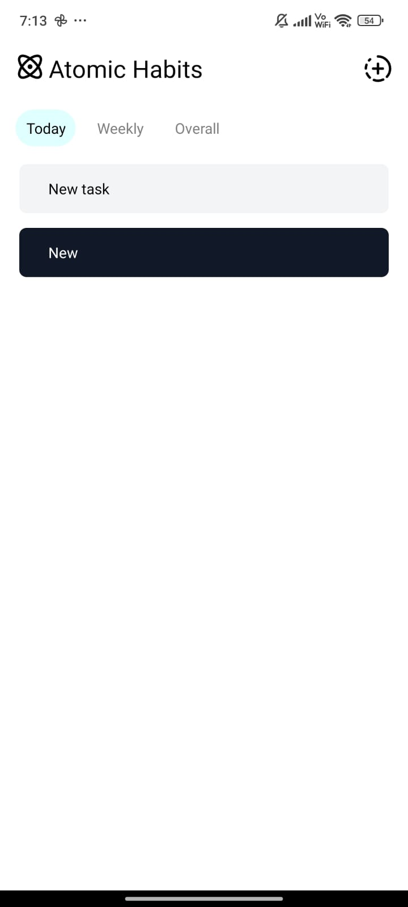
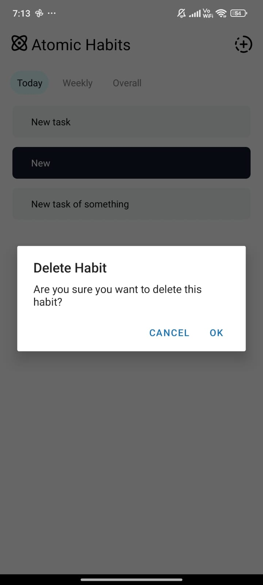

markdownCopy# Atomic Habits Tracker

A powerful and intuitive habit tracking application built with React Native and Expo, designed to help you build and maintain positive habits.

## Features

- 📅 Daily, weekly, and overall habit tracking
- ✅ Easy habit completion with a single tap
- 🗑️ Long-press to delete unwanted habits
- 🎨 Clean and intuitive user interface
- 🔄 Real-time updates with optimistic UI
- 📊 Progress visualization (coming soon)

## Screenshots

  <table>
    <tr>
      <td></td>
      <td></td>
      <td></td>
    </tr>
    <tr>
      <td></td>
      <td></td>
      <td></td>
    </tr>
  </table>

## Getting Started

### Prerequisites

- Node.js (v14 or later)
- npm or yarn
- Expo CLI

### Installation

1. Clone the repository:
git clone https://github.com/yourusername/atomic-habits-tracker.git
Copy
2. Navigate to the project directory:
cd atomic-habits-tracker
Copy
3. Install dependencies:
npm install
Copyor
yarn install
Copy
4. Start the Expo development server:
npx expo start
Copy
5. Use the Expo Go app on your mobile device to scan the QR code and run the app.

## Tech Stack

- React Native
- Expo
- NativeWind (TailwindCSS for React Native)
- Expo Router

## Contributing

Contributions are welcome! Please feel free to submit a Pull Request.

## License

This project is licensed under the MIT License - see the [LICENSE](LICENSE) file for details.

## Acknowledgments

- Inspired by James Clear's "Atomic Habits" 
